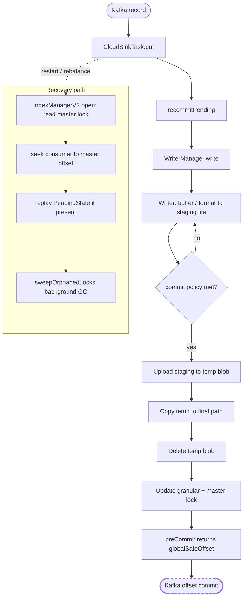

# Datalake Sink — Data Loss & Exactly-Once Test Diligence

Can this connector lose data? Can it duplicate records when running in exactly-once mode? This document
maps every relevant test in the datalake sink stack to the customer-facing question it answers, and is
the single place to audit the diligence behind those guarantees.

For the write-pipeline mechanics see [datalake-sinks-write-pipeline.md](datalake-sinks-write-pipeline.md).
For the two-tier lock and exactly-once design see [datalake-exactly-once-partitionby.md](datalake-exactly-once-partitionby.md).

---

## The two guarantees we test for

1. **No data loss.** Every Kafka record acknowledged by the connector is durably present in the
   configured cloud-storage path before its offset is committed back to Kafka. If anything between
   buffering and the offset commit fails, the offset is **not** advanced and the record is redelivered
   on the next attempt.
2. **No duplicates under exactly-once.** With `EXACTLY_ONCE` indexing enabled, the same Kafka record
   never appears twice at the final path — even across task crashes, restarts, rebalances, or mid-commit
   failures. The two-tier lock (master lock + per-partition-key granular lock) plus the `shouldSkip`
   filter on replay together guarantee idempotence.

These guarantees hold for all three supported providers — AWS S3, Google Cloud Storage, and Azure ADLS
Gen2 — and the same scenarios are exercised against each provider's emulator (see
[Provider parity](#provider-parity) below).

---

## How we prove each guarantee

The diligence rests on three layers of evidence, every one of which runs on every CI build:

- **Failure-injection unit tests.** Every failure point between buffering and offset commit has a
  dedicated test that injects the failure, asserts the writer state, asserts that no offset advances
  past unflushed data, and asserts the recovery path. These run against an `InMemoryStorageInterface`
  test double, no infrastructure required.
- **Emulator integration tests.** The same scenarios run end-to-end against real provider emulators —
  LocalStack for S3, `fake-gcs-server` for GCS, Azurite for Azure ADLS — so provider-specific semantics
  (rename idempotence, eTag-conditional writes, 4xx mappings) are validated against the real SDK.
- **Provider-side idempotence tests.** A small set of unit tests pin the SDK-level rules the connector
  relies on (e.g. ADLS rename returning 404 with `source-missing + dest-present` narrows to `Right(())`,
  S3 KMS 400 errors are not silently masked).

The path each record takes is shown below. Every arrow has at least one failure-mode test behind it.
The dashed border on `Kafka offset commit` highlights the only stage owned by the Kafka Connect
framework rather than the connector — see [What we explicitly do not test](#what-we-explicitly-do-not-test).

---

## Failure scenarios and customer outcomes

Each row below answers, for one failure shape, the only two questions a customer cares about:
**could a record be lost?** and **could a record be duplicated?** The answer in every row is **no**,
with the test evidence cited so the reader can verify the assertion directly. Internal mechanics
(`PendingState`, `globalSafeOffset`, `shouldSkip`, etc.) are summarised in the **Recovery** column for
context; the deeper per-stage breakdown lives in the engineering appendix at the bottom of this file.

| # | Scenario | Could a record be lost? | Could a record be duplicated? | Recovery | Test evidence |
|---|---|---|---|---|---|
| 1 | The flush threshold has not been reached, so the writer is still buffering records on disk. | **No.** Data sits on local disk; `preCommit` returns `min(firstBufferedOffset)` so Kafka offsets do not advance past unflushed records. | **No.** No commit has been attempted; nothing is in cloud storage. | Buffering continues until the count / size / interval threshold fires. | [`WriterCommitManagerTest`](../kafka-connect-cloud-common/src/test/scala/io/lenses/streamreactor/connect/cloud/common/sink/writer/WriterCommitManagerTest.scala) "commitFlushableWritersForTopicPartition should continue if no writers require flushing" (line 183); [`WriterManagerPreCommitTest`](../kafka-connect-cloud-common/src/test/scala/io/lenses/streamreactor/connect/cloud/common/sink/writer/WriterManagerPreCommitTest.scala) "preCommit returns min(firstBufferedOffset) when writers have uncommitted data" (line 184) |
| 2 | The flush fired but the upload to cloud storage failed transiently (network blip, throttling, AccessDenied). | **No.** The local staging file is preserved; `preCommit` does not advance; the writer stays in `Uploading`. | **No.** No cloud-side state survives the failed attempt; the next retry uses a fresh `tempFileUuid` so a partially-uploaded blob cannot be confused for a successful one. | `recommitPending` retries on the next `put` with a new `tempFileUuid` until success. | [`WriterUploadRetryRecoveryTest`](../kafka-connect-cloud-common/src/test/scala/io/lenses/streamreactor/connect/cloud/common/sink/writer/WriterUploadRetryRecoveryTest.scala) "transient upload failure leaves writer in Uploading; recommitPending recovers without data loss" (line 108); [`PendingOperationsProcessorsTest`](../kafka-connect-cloud-common/src/test/scala/io/lenses/streamreactor/connect/cloud/common/sink/seek/PendingOperationsProcessorsTest.scala) single-op `[Upload]` transient `NonFatal` (line 596); [`CloudSinkTaskTest`](../kafka-connect-cloud-common/src/test/scala/io/lenses/streamreactor/connect/cloud/common/sink/writer/CloudSinkTaskTest.scala) `recommitPending` second-poll (line 666) and empty-poll (line 693) |
| 3 | Upload succeeded (the temp blob is now durable in cloud storage), but the rename to the final path failed. | **No.** The temp blob is still in cloud storage; the granular lock retains `PendingState=[Copy, Delete]` so the rename is replayed; `cleanUp(tp)` preserves master-lock state and `seekedOffsets` for in-place retry. | **No.** Provider rename narrows `source-missing + dest-present` to success on replay (S3, GCS, Azure); records past `committedOffset` are filtered by `shouldSkip`. | `ensureGranularLock` replays the pending Copy + Delete idempotently on the next `put` (LC-2451 same-instance retry) or on the next task restart — both paths are tested. | [`PendingOperationsProcessorsTest`](../kafka-connect-cloud-common/src/test/scala/io/lenses/streamreactor/connect/cloud/common/sink/seek/PendingOperationsProcessorsTest.scala) "should escalate mid-chain Copy failure to Fatal" (line 282); [`CloudSinkTaskTest`](../kafka-connect-cloud-common/src/test/scala/io/lenses/streamreactor/connect/cloud/common/sink/writer/CloudSinkTaskTest.scala) "mid-chain Copy failure under RETRY throws FatalConnectException, NOT RetriableException" (line 230); [`ExactlyOnceScenarioTest`](../kafka-connect-cloud-common/src/test/scala/io/lenses/streamreactor/connect/cloud/common/sink/ExactlyOnceScenarioTest.scala) crash-after-upload (line 149) and LC-2451 in-place rollback (line 398) |
| 4 | Upload and rename to the final path both succeeded; only the cleanup delete of the temp blob failed. | **No.** The data is already at the final path. | **No.** The orphaned temp blob is not part of the final output and never participates in any future read. | The next commit refreshes the granular lock; the orphan is reaped by an operator-managed bucket lifecycle policy until a dedicated sweep ships in a follow-up. | [`PendingOperationsProcessorsTest`](../kafka-connect-cloud-common/src/test/scala/io/lenses/streamreactor/connect/cloud/common/sink/seek/PendingOperationsProcessorsTest.scala) "should skip further operations if delete fails" (line 165); [`ExactlyOnceScenarioTest`](../kafka-connect-cloud-common/src/test/scala/io/lenses/streamreactor/connect/cloud/common/sink/ExactlyOnceScenarioTest.scala) "crash after copy before delete: replay cleans temp and delivers once" (line 170) |
| 5 | The task crashed AFTER the rename succeeded but BEFORE the lock could be updated; on replay the source temp blob is gone and the destination already exists. | **No.** Bytes are at the final path; the master lock acts as the durable seek floor on restart. | **No.** Provider rename narrows the 404 to `Right(())` on every supported provider; replay does NOT re-write the file; redelivered records past `committedOffset` are filtered by `shouldSkip`. | `IndexManagerV2.open` reads the master lock, the consumer seeks back, and `ensureGranularLock` replays the remaining `PendingState` idempotently. | [`AzureDatalakeReplayScenariosTest`](../kafka-connect-azure-datalake/src/it/scala/io/lenses/streamreactor/connect/datalake/sink/AzureDatalakeReplayScenariosTest.scala) "ADLS crash-after-Copy" (line 86); "ADLS rename returns 404 source-missing/dest-present during a replay — sink task does NOT throw fatal" (line 147); [`DatalakeStorageInterfaceTest`](../kafka-connect-azure-datalake/src/test/scala/io/lenses/streamreactor/connect/datalake/storage/DatalakeStorageInterfaceTest.scala) `mvFile` source-absent + dest-present idempotence; IT [`CoreSinkTaskTestCases`](../kafka-connect-azure-datalake/src/it/scala/io/lenses/streamreactor/connect/cloud/common/sink/CoreSinkTaskTestCases.scala) crash-after-Copy scenario per provider |
| 6 | Bytes have landed at the final path, but the conditional master-lock write that would advance the offset failed (eTag mismatch, transient cloud read-timeout). | **No.** Data is durable at the final path. | **No.** `preCommit` returns no offset for the affected partition; the high-watermark is NOT advanced; GC is skipped so granular locks survive for the next attempt. | The next `preCommit` cycle retries the master-lock write; `globalSafeOffset` is recomputed; recovery succeeds without data loss or duplication. | [`WriterManagerPreCommitTest`](../kafka-connect-cloud-common/src/test/scala/io/lenses/streamreactor/connect/cloud/common/sink/writer/WriterManagerPreCommitTest.scala) "preCommit returns no offset when master lock update fails" (line 295); "preCommit does not advance high watermark on master lock failure" (line 311); "preCommit skips GC on master lock update failure" (line 423); [`ExactlyOnceScenarioTest`](../kafka-connect-cloud-common/src/test/scala/io/lenses/streamreactor/connect/cloud/common/sink/ExactlyOnceScenarioTest.scala) "crash during master-lock CAS: a stale-eTag write fails fenced, recovery succeeds" (line 189); [`GranularLockScenarioTest`](../kafka-connect-cloud-common/src/test/scala/io/lenses/streamreactor/connect/cloud/common/sink/writer/GranularLockScenarioTest.scala) "preCommit returns no offset when updateMasterLock fails (fencing)" (line 447) |
| 7 | The local staging file is missing during a live commit (e.g. ephemeral pod disk wiped). | **No.** The records are still in Kafka; on restart the master-lock seek-back redelivers them and a new staging file is written from the redelivered batch. | **No.** Nothing was written to cloud storage from the failed attempt; there is no prior cloud-side state to deduplicate against. | `escalateOnCancel=true` raises `FatalCloudSinkError` under all error policies (RETRY, NOOP, THROW); the task fails fast, Connect restarts it, and the master lock governs the seek-back. | [`WriterUploadRetryRecoveryTest`](../kafka-connect-cloud-common/src/test/scala/io/lenses/streamreactor/connect/cloud/common/sink/writer/WriterUploadRetryRecoveryTest.scala) "missing local file (live commit) escalates to FatalCloudSinkError" (line 114); "recommitPending after staging-dir wipe escalates to FatalCloudSinkError (SECOND live-escalate entry point)" (line 128); [`CloudSinkTaskTest`](../kafka-connect-cloud-common/src/test/scala/io/lenses/streamreactor/connect/cloud/common/sink/writer/CloudSinkTaskTest.scala) live-commit policy matrix (lines 114–146), rollback chain (line 148), preCommit non-advancement IndexManagerV2 + NoIndexManager (lines 164, 174); IT [`AzureDatalakeReplayScenariosTest`](../kafka-connect-azure-datalake/src/it/scala/io/lenses/streamreactor/connect/datalake/sink/AzureDatalakeReplayScenariosTest.scala) "fail fast when staging directory is deleted mid-commit (Azure parity)" (line 206) |
| 8 | The connector's `preCommit` succeeded, but the Kafka broker rejected the subsequent consumer-group offset commit (broker error, ISR loss). | **No.** Bytes are durable at the final path; the master lock has the new `committedOffset`. Kafka redelivers the records on the next poll and the master lock acts as the seek floor on restart. | **No.** Records past `committedOffset` are filtered by `shouldSkip` on replay; HWM monotonicity prevents the next `preCommit` from regressing below the failed offset. | **Stage owned by the Kafka Connect framework** — see [What we explicitly do not test](#what-we-explicitly-do-not-test). The connector's invariants (HWM monotonicity + master-lock seek floor) make at-least-once redelivery the worst case. | [`WriterManagerOffsetInvariantsScenarioTest`](../kafka-connect-cloud-common/src/test/scala/io/lenses/streamreactor/connect/cloud/common/sink/writer/WriterManagerOffsetInvariantsScenarioTest.scala) HWM monotonicity (9 tests, lines 436–576); [`GranularLockScenarioTest`](../kafka-connect-cloud-common/src/test/scala/io/lenses/streamreactor/connect/cloud/common/sink/writer/GranularLockScenarioTest.scala) "HWM initialization from master lock prevents master lock regression across restarts" (line 1232) |

For the per-stage breakdown with explicit `covered / partial / gap` verdicts and the full list of tests
per stage, see the [Pipeline failure mosaic](#pipeline-failure-mosaic) in the engineering appendix.

---

## Provider parity

The same scenarios run against every supported provider's emulator. "shared IT" means the scenario lives
in `CoreSinkTaskTestCases` and is executed by each provider's binding class; "provider unit" means a
provider-specific unit-level test.

| Scenario | S3 | GCS | Azure |
|---|---|---|---|
| Crash-after-Copy SinkTask replay (source absent + dest present → idempotent) | shared IT | shared IT | shared IT + [`AzureDatalakeReplayScenariosTest`](../kafka-connect-azure-datalake/src/it/scala/io/lenses/streamreactor/connect/datalake/sink/AzureDatalakeReplayScenariosTest.scala) "ADLS crash-after-Copy" (line 86) and "ADLS rename returns 404 source-missing/dest-present during a replay — sink task does NOT throw fatal" (line 147) |
| Staging directory wiped mid-commit → fail-fast | — | — | [`AzureDatalakeReplayScenariosTest`](../kafka-connect-azure-datalake/src/it/scala/io/lenses/streamreactor/connect/datalake/sink/AzureDatalakeReplayScenariosTest.scala) "fail fast when staging directory is deleted mid-commit (Azure parity)" (line 206) |
| Tombstone bytes format | shared IT | shared IT (parity) | shared IT |
| Avro / JSON / Parquet envelope write | shared IT | shared IT | shared IT |
| `mvFile` 404 idempotence | provider unit | — | provider unit |
| `mvFile` 403/409 non-masking | — | — | provider unit |
| `mvFile` permanent error (KMS/400) | provider unit | — | — |
| Schema optimization (Parquet) | IT | IT | — |

GCS and Azure do not have a dedicated unit-level `mvFile` test for the KMS/permanent-error case; only S3
covers it today. The `staging directory wiped mid-commit` scenario is currently exercised only on Azure;
the recovery path is shared across providers, so a parallel test on S3/GCS would be a low-cost parity
addition.

---

## What we explicitly do not test

We are transparent about coverage gaps. The items below are NOT directly simulated, with an explanation
of why each gap is acceptable for the data-loss / no-duplicate guarantees.

| Scenario | Why we do not test it directly | Why it is acceptable |
|---|---|---|
| **Kafka broker offset commit failures.** The framework-side step that runs after `SinkTask.preCommit` returns. | This commit is owned by the Kafka Connect framework, not the connector. The boundary is outside what the connector code can intercept. | The connector enforces two invariants that together convert any framework-side failure into safe at-least-once redelivery: (1) `globalSafeOffset` HWM monotonicity (9 tests in [`WriterManagerOffsetInvariantsScenarioTest`](../kafka-connect-cloud-common/src/test/scala/io/lenses/streamreactor/connect/cloud/common/sink/writer/WriterManagerOffsetInvariantsScenarioTest.scala) lines 436–576), so the next `preCommit` returns an offset ≥ the failed one; (2) the master lock acts as a durable seek floor on restart ([`GranularLockScenarioTest`](../kafka-connect-cloud-common/src/test/scala/io/lenses/streamreactor/connect/cloud/common/sink/writer/GranularLockScenarioTest.scala) "HWM initialization from master lock prevents master lock regression across restarts" line 1232). No record is permanently lost or silently duplicated. |
| **PARTITIONBY paths longer than the provider's key-length limit.** | The byte/character rule differs by provider (S3/GCS-flat: 1024 bytes UTF-8; ADLS Gen2: 1024 characters; GCS-HNS: 512+512 split), so a single connector-side check would either over-reject or under-reject. | The cloud SDK rejects the request with a 4xx, the connector maps the resulting `UploadError` to `FatalCloudSinkError` via `ensureGranularLock` / `updateForPartitionKey`, and **no data is written**. The operator sees the SDK error message instead of a connector-authored "PARTITIONBY too long" error — the safety property (no silent loss, no partial write) is unchanged. Documented as an operator contract. |
| **Key-length enforcement in `InMemoryStorageInterface`.** | The unit-test double is intentionally lenient because each real provider has a different limit (byte vs character). Enforcing one rule in the double would diverge from at least one provider. | Production-side fatal mapping for over-long keys is covered indirectly by the integration tests against the real emulators, which use the actual SDK rules. |

---

# Test inventory (engineering reference)

The sections below are the per-stage engineering view used by the connector team to maintain coverage
and to catch regressions quickly. Customer evaluators can stop at the previous section; the material
below is the full, line-numbered audit trail behind each guarantee.

## Pipeline failure mosaic

This section walks the commit pipeline stage by stage and answers, for each stage, "what failure shapes
are exercised, what is the recovery path, and which tests pin them?"

The pipeline a writer traverses on every commit is:

Stages drawn with a dashed border are coverage gaps — see [What we explicitly do not test](#what-we-explicitly-do-not-test).

The matrix below uses three verdicts: `covered` (one or more dedicated tests pin the failure shape and recovery),
`partial` (closely related tests exist but the exact stage failure in isolation is not asserted), `gap` (no test).

### Stage A — Writer needs to commit (flush threshold met)

| Failure shape | Recovery path | Test(s) | Verdict |
|---|---|---|---|
| Count / size / interval flush threshold reached on at least one writer for a TP — all writers for that TP must commit together (required for `globalSafeOffset` correctness) | `WriterCommitManager` flushes ALL writers on the TP, not just the one that hit the threshold | [`WriterCommitManagerTest`](../kafka-connect-cloud-common/src/test/scala/io/lenses/streamreactor/connect/cloud/common/sink/writer/WriterCommitManagerTest.scala) (12 tests covering `commitPending`, `commitForTopicPartition`, `commitFlushableWriters`, `commitFlushableWritersForTopicPartition`); [`commit/CommitPolicyTest`](../kafka-connect-cloud-common/src/test/scala/io/lenses/streamreactor/connect/cloud/common/sink/commit/CommitPolicyTest.scala); [`commit/CountTest`](../kafka-connect-cloud-common/src/test/scala/io/lenses/streamreactor/connect/cloud/common/sink/commit/CountTest.scala); [`commit/FileSizeTest`](../kafka-connect-cloud-common/src/test/scala/io/lenses/streamreactor/connect/cloud/common/sink/commit/FileSizeTest.scala); [`commit/IntervalTest`](../kafka-connect-cloud-common/src/test/scala/io/lenses/streamreactor/connect/cloud/common/sink/commit/IntervalTest.scala); IT KCQL `flush.count=1` in [`AzureDatalakeReplayScenariosTest`](../kafka-connect-azure-datalake/src/it/scala/io/lenses/streamreactor/connect/datalake/sink/AzureDatalakeReplayScenariosTest.scala) | covered |
| Any writer in the TP-wide flush group fails its commit | The whole flush call returns `Left(error)` so `handleErrors` can classify it correctly; sibling success persists durably | `WriterCommitManagerTest` "should return an error if any writer fails to commit" / "...for the given topic partition" (lines 68, 92, 121, 145, 164) | covered |
| Time-flush fires for an idle writer (no buffered records, `NoWriter` state) | `commit` is a no-op; `processPendingOperations` is NOT called; no temp blob is written | [`WriterTest`](../kafka-connect-cloud-common/src/test/scala/io/lenses/streamreactor/connect/cloud/common/sink/writer/WriterTest.scala) "time-flush with no records (NoWriter state) — commit is a no-op" (line 753) | covered |

### Stage B — Upload (staging file → `.temp-upload/<uuid>`)

| Failure shape | Recovery path | Test(s) | Verdict |
|---|---|---|---|
| Transient `UploadFailedError` (network, throttling, AccessDenied) | Returned as `NonFatalCloudSinkError`; writer stays in `Uploading`; staging file preserved on disk; `recommitPending` retries on next `put` with a NEW `tempFileUuid` (no cloud-side state from the failed attempt) | [`WriterUploadRetryRecoveryTest`](../kafka-connect-cloud-common/src/test/scala/io/lenses/streamreactor/connect/cloud/common/sink/writer/WriterUploadRetryRecoveryTest.scala) "transient upload failure leaves writer in Uploading; recommitPending recovers without data loss" (line 108); [`PendingOperationsProcessorsTest`](../kafka-connect-cloud-common/src/test/scala/io/lenses/streamreactor/connect/cloud/common/sink/seek/PendingOperationsProcessorsTest.scala) "single-op `[Upload]` chain + transient `UploadFailedError` returns `NonFatalCloudSinkError`, not Fatal (NoIndexManager regression guard)" (line 596); "transient Upload `NonFatal` propagated as-is in multi-step chain (no escalation, no `fnIndexUpdate`)" (line 194); "`UploadFailedError` (AccessDeniedException simulation) classified as `NonFatalCloudSinkError`, not Fatal" (line 774); [`WriterTest`](../kafka-connect-cloud-common/src/test/scala/io/lenses/streamreactor/connect/cloud/common/sink/writer/WriterTest.scala) "Upload transient failure (e.g. OS-locked staging file) returns `NonFatalCloudSinkError`; writer stays in Uploading" (line 681); [`CloudSinkTaskTest`](../kafka-connect-cloud-common/src/test/scala/io/lenses/streamreactor/connect/cloud/common/sink/writer/CloudSinkTaskTest.scala) `recommitPending` second-poll completion (line 666); empty-poll still triggers `recommitPending` (line 693); each `Writer.commit` attempt generates a distinct `tempFileUuid` (line 730) | covered |
| `NonExistingFileError` (staging file gone) — live commit, `escalateOnCancel=true` | `escalateLiveCancel`: best-effort `fnIndexUpdate(committedOffset, None)` then returns `Left(FatalCloudSinkError)`; writer STAYS in `Uploading` until `cleanUp(tp)` → `Writer.close()`; task fails under all error policies (RETRY does NOT wrap in `RetriableException`); on restart `IndexManagerV2.open` reads master lock and consumer seeks back | [`PendingOperationsProcessorsTest`](../kafka-connect-cloud-common/src/test/scala/io/lenses/streamreactor/connect/cloud/common/sink/seek/PendingOperationsProcessorsTest.scala) "with escalateOnCancel=true, NonExistingFile on Upload escalates to Fatal with rich message" (line 317); "with escalateOnCancel=true, fnIndexUpdate failure does NOT mask the Fatal" (line 363); "single-op `[Upload]` (NoIndexManager path) escalates Fatal on NonExistingFileError" (line 459); PARTITIONBY first-commit variants with `committedOffset=None` (lines 514, 559); [`WriterUploadRetryRecoveryTest`](../kafka-connect-cloud-common/src/test/scala/io/lenses/streamreactor/connect/cloud/common/sink/writer/WriterUploadRetryRecoveryTest.scala) "missing local file (live commit) escalates to FatalCloudSinkError" (line 114); structural pin "Writer.commit always passes escalateOnCancel=true" non-PARTITIONBY + PARTITIONBY (lines 120, 124); "recommitPending after staging-dir wipe escalates to FatalCloudSinkError (SECOND live-escalate entry point)" (line 128); multi-pk fatal-isolation (lines 203, 337); "NoIndexManager — writer in Uploading whose staging file is gone fails fast" (line 904); [`CloudSinkTaskTest`](../kafka-connect-cloud-common/src/test/scala/io/lenses/streamreactor/connect/cloud/common/sink/writer/CloudSinkTaskTest.scala) live-commit policy matrix (lines 114–146); rollback chain clears `WriterManager` writer state (line 148); does NOT advance `preCommit` for either `IndexManagerV2` or `NoIndexManager` (lines 164, 174); mixed-batch isolation to fatal TPs (line 188) | covered |
| `NonExistingFileError` — dead-worker recovery, `escalateOnCancel=false` | Graceful clear: `fnIndexUpdate(oldCommittedOffset, None)` clears `PendingState`; returns `Right(oldCommittedOffset)`; `toNoWriter(oldCommittedOffset)` does NOT advance `committedOffset`; consumer re-delivers records | [`PendingOperationsProcessorsTest`](../kafka-connect-cloud-common/src/test/scala/io/lenses/streamreactor/connect/cloud/common/sink/seek/PendingOperationsProcessorsTest.scala) "gracefully clears pending state when first Upload fails with NonExistingFileError (dead-worker recovery)" (line 240); "should clear pending state via fnIndexUpdate when last op upload fails due to missing files" (line 106); "escalateOnCancel=false on single-op `[Upload]` gracefully clears" (line 491) | covered |
| 0-byte staging file uploaded | Chain completes normally; `processPendingOperations` does not crash | [`PendingOperationsProcessorsTest`](../kafka-connect-cloud-common/src/test/scala/io/lenses/streamreactor/connect/cloud/common/sink/seek/PendingOperationsProcessorsTest.scala) "Upload of a 0-byte staging file completes the chain" (line 734) | covered |
| Successful Upload returns a fresh eTag | New eTag is propagated into the subsequent `CopyOperation` and `DeleteOperation` (NOT the original placeholder) | [`PendingOperationsProcessorsTest`](../kafka-connect-cloud-common/src/test/scala/io/lenses/streamreactor/connect/cloud/common/sink/seek/PendingOperationsProcessorsTest.scala) "successful Upload propagates the new eTag to the subsequent CopyOperation and DeleteOperation" (line 627) | covered |

### Stage C — Upload OK, Copy fails (mid-chain)

| Failure shape | Recovery path | Test(s) | Verdict |
|---|---|---|---|
| `mvFile` returns `Left(FileMoveError)` mid-chain (Upload already wrote `.temp-upload/<uuid>` durably) | Always `FatalCloudSinkError` regardless of `escalateOnCancel`; `cleanUp(tp)` closes writers, evicts granular cache, preserves master-lock state and `seekedOffsets`; granular lock retains `PendingState=[Copy, Delete]` referencing the still-present temp blob | [`PendingOperationsProcessorsTest`](../kafka-connect-cloud-common/src/test/scala/io/lenses/streamreactor/connect/cloud/common/sink/seek/PendingOperationsProcessorsTest.scala) "should escalate mid-chain Copy failure to Fatal" (line 282); "escalateOnCancel=true does NOT change Copy/Delete error classification (mid-chain Copy still Fatal)" (line 414); "transient Copy failure escalates Fatal immediately (single mvFile call, no in-process retry; mirror dichotomy with transient Upload)" — pins the deliberate Copy-vs-Upload retry-policy dichotomy; end-to-end [`CloudSinkTaskTest`](../kafka-connect-cloud-common/src/test/scala/io/lenses/streamreactor/connect/cloud/common/sink/writer/CloudSinkTaskTest.scala) "mid-chain Copy failure (FatalCloudSinkError) under error.policy=RETRY throws FatalConnectException, NOT RetriableException" (line 230) — also asserts the `.temp-upload` blob is still present in storage for crash-recovery | covered |
| Crash after Upload, before Copy: task restarts | `IndexManagerV2.open` reads master + granular locks; `ensureGranularLock` detects `PendingState=[Copy, Delete]`; `resolveAndCacheGranularLock` replays Copy and Delete against the still-present `.temp-upload/<uuid>`; consumer re-delivers any records past the master `committedOffset` and they are deduped via `shouldSkip` | [`ExactlyOnceScenarioTest`](../kafka-connect-cloud-common/src/test/scala/io/lenses/streamreactor/connect/cloud/common/sink/ExactlyOnceScenarioTest.scala) "crash after upload before copy: replay completes pending op and delivers once" (line 149); "PARTITIONBY: Copy/Delete pending recovery resolves via ensureGranularLock (resolveAndCacheGranularLock path)" (line 330); "non-PARTITIONBY: Copy failure returns FatalCloudSinkError and no temp blob is orphaned after recovery" (line 551); "PARTITIONBY: crash-after-Copy idempotence: recovery does not escalate when source absent and dest present" (line 352) | covered |
| LC-2451 in-place rollback (no restart): `cleanUp(tp)` runs; Connect retries `put` on the SAME task instance | Next `put` → `createWriter` → `ensureGranularLock` detects the persisted `PendingState`, completes Copy + Delete BEFORE the writer accepts new records; `preCommit` advances afterwards; no duplication | [`ExactlyOnceScenarioTest`](../kafka-connect-cloud-common/src/test/scala/io/lenses/streamreactor/connect/cloud/common/sink/ExactlyOnceScenarioTest.scala) LC-2451 retry-on-same-instance test (line 398) | covered |
| Provider-level idempotence on the replay Copy: the source `.temp-upload/<uuid>` is absent because a previous instance already moved it, dest is present | `mvFile` source-absent + dest-present narrows to `Right(())` at the storage layer; replay does not escalate | [`AwsS3StorageInterfaceTest`](../kafka-connect-aws-s3/src/test/scala/io/lenses/streamreactor/connect/aws/s3/storage/AwsS3StorageInterfaceTest.scala); [`DatalakeStorageInterfaceTest`](../kafka-connect-azure-datalake/src/test/scala/io/lenses/streamreactor/connect/datalake/storage/DatalakeStorageInterfaceTest.scala); IT [`AzureDatalakeReplayScenariosTest`](../kafka-connect-azure-datalake/src/it/scala/io/lenses/streamreactor/connect/datalake/sink/AzureDatalakeReplayScenariosTest.scala) "ADLS rename returns 404 source-missing/dest-present during a replay — sink task does NOT throw fatal" (line 147); IT `CoreSinkTaskTestCases` crash-after-Copy scenario per provider | covered |

### Stage D — Upload + Copy OK, Delete fails (last op)

| Failure shape | Recovery path | Test(s) | Verdict |
|---|---|---|---|
| `deleteFile` returns `Left(FileDeleteError)` on the last op | Classified as `NonFatal`; chain abandoned; data is durable at the final path; the `.temp-upload/<uuid>` blob is orphaned but is NOT re-attempted by the connector — it must be reaped by an operator-managed bucket lifecycle policy until a dedicated sweep ships in a follow-up ticket; writer stays in `Uploading`; next `recommitPending` builds a NEW chain (orphan accumulates per failed delete) | [`PendingOperationsProcessorsTest`](../kafka-connect-cloud-common/src/test/scala/io/lenses/streamreactor/connect/cloud/common/sink/seek/PendingOperationsProcessorsTest.scala) "should skip further operations if delete fails" (line 165); "escalateOnCancel=true does NOT change Copy/Delete error classification (last-op Delete still NonFatal)" (line 437); "escalateOnCancel=true does NOT change last-op Copy error classification (NonFatal, symmetric with last-op Delete)" (line 668) | covered |
| Crash after Copy, before Delete | `PendingState=[Delete <uuid>]` persists in the granular lock; on restart `ensureGranularLock` replays Delete; the dest blob is already at the final path so no duplication | [`ExactlyOnceScenarioTest`](../kafka-connect-cloud-common/src/test/scala/io/lenses/streamreactor/connect/cloud/common/sink/ExactlyOnceScenarioTest.scala) "crash after copy before delete: replay cleans temp and delivers once" (line 170); "PARTITIONBY: Copy/Delete pending recovery resolves via ensureGranularLock" (line 330) | covered |

### Stage E — Upload + Copy + Delete OK, granular `IndexUpdate` (final lock CAS) fails

| Failure shape | Recovery path | Test(s) | Verdict |
|---|---|---|---|
| All three storage operations succeeded; only the FINAL `fnIndexUpdate` (clear `PendingState`, advance `committedOffset`) returns `Left` (e.g. eTag mismatch from a concurrent task or transient cloud read-timeout) | Producer retains a granular lock with stale `PendingState=[]` semantics until the next commit refreshes it; `committedOffset` does not advance in cloud (in memory it does NOT advance either because `processPendingOperations` returns the `Left`); `preCommit` will not surface a new offset; on restart, master-lock seek-back replays records that are already at the final path → duplicates filtered by `shouldSkip` against the granular lock | [`PendingOperationsProcessorsTest`](../kafka-connect-cloud-common/src/test/scala/io/lenses/streamreactor/connect/cloud/common/sink/seek/PendingOperationsProcessorsTest.scala) "Stage E: final fnIndexUpdate failure after Upload+Copy+Delete success propagates Left; committedOffset does not advance" (pins the success-arm `Left`-propagation contract in `processOperations` line 230) | covered |

### Stage F — IndexUpdate OK, master-lock `preCommit` write fails

| Failure shape | Recovery path | Test(s) | Verdict |
|---|---|---|---|
| `WriterManager.preCommit` runs `updateMasterLock` and the eTag-conditional write fails | `preCommit` returns no offset for that TP; HWM is NOT advanced; GC of obsolete granular locks is skipped (so granular locks survive for the next attempt); on next `preCommit` call, `globalSafeOffset` is recomputed and a fresh `updateMasterLock` is attempted | [`WriterManagerPreCommitTest`](../kafka-connect-cloud-common/src/test/scala/io/lenses/streamreactor/connect/cloud/common/sink/writer/WriterManagerPreCommitTest.scala) "preCommit returns no offset when master lock update fails" (line 295); "preCommit does not advance high watermark on master lock failure" (line 311); "preCommit skips GC on master lock update failure" (line 423); end-to-end [`GranularLockScenarioTest`](../kafka-connect-cloud-common/src/test/scala/io/lenses/streamreactor/connect/cloud/common/sink/writer/GranularLockScenarioTest.scala) "preCommit returns no offset when updateMasterLock fails (fencing)" (line 447); harness-level [`ExactlyOnceScenarioTest`](../kafka-connect-cloud-common/src/test/scala/io/lenses/streamreactor/connect/cloud/common/sink/ExactlyOnceScenarioTest.scala) "crash during master-lock CAS: a stale-eTag write fails fenced, recovery succeeds" (line 189) | covered |
| Master-lock cache miss (zombie task) on `updateMasterLock` or `updateForPartitionKey` | Returns `FatalCloudSinkError` WITHOUT any I/O — fences out the zombie before it can write | [`IndexManagerV2Test`](../kafka-connect-cloud-common/src/test/scala/io/lenses/streamreactor/connect/cloud/common/sink/seek/IndexManagerV2Test.scala) zombie-fencing guards on `updateMasterLock` and `updateForPartitionKey` | covered |

### Stage G — preCommit OK, Kafka offset commit fails

| Failure shape | Recovery path | Test(s) | Verdict |
|---|---|---|---|
| `SinkTask.preCommit` returned an advanced offset to Kafka Connect, but the framework's subsequent consumer-group offset commit fails (broker error, ISR loss, etc.) | The connector relies on two invariants: (1) `globalSafeOffset` HWM monotonicity, so the NEXT `preCommit` returns an offset that is ≥ the failed one, and Connect retries the framework-level commit on the next cycle; (2) the master lock as the durable seek floor — on restart, `IndexManagerV2.open` reads the master lock and seeks the consumer back, so any record up to the last successful master-lock write is idempotently replayable | **Not simulated** — the Kafka commit step is owned by the Connect framework. Indirect coverage via the two invariants: [`WriterManagerOffsetInvariantsScenarioTest`](../kafka-connect-cloud-common/src/test/scala/io/lenses/streamreactor/connect/cloud/common/sink/writer/WriterManagerOffsetInvariantsScenarioTest.scala) (9 tests at lines 436–576: HWM holds across eviction, rebalance, retry, multi-TP interleaving, long monotone sequences); [`GranularLockScenarioTest`](../kafka-connect-cloud-common/src/test/scala/io/lenses/streamreactor/connect/cloud/common/sink/writer/GranularLockScenarioTest.scala) "HWM initialization from master lock prevents master lock regression across restarts" (line 1232); [`IndexManagerV2Test`](../kafka-connect-cloud-common/src/test/scala/io/lenses/streamreactor/connect/cloud/common/sink/seek/IndexManagerV2Test.scala) `open` + master-lock read tests | gap (out-of-scope; framework concern) |

### Stage H — Restart and seek (universal fallback)

| Failure shape | Recovery path | Test(s) | Verdict |
|---|---|---|---|
| Task fails for any reason (Fatal, retry budget exhausted, JVM crash, container kill) | Connect schedules a restart; `CloudSinkTask.open()` → `IndexManagerV2.open()` reads the master lock; `context.offset(tp, committedOffset)` seeks the consumer back; any in-flight `PendingState` is replayed; records re-delivered are deduped via `shouldSkip` against the granular and master locks | IT crash-after-Copy via `CoreSinkTaskTestCases` (S3, GCS, Azure); harness rebalance and two-TP independence: [`ExactlyOnceScenarioTest`](../kafka-connect-cloud-common/src/test/scala/io/lenses/streamreactor/connect/cloud/common/sink/ExactlyOnceScenarioTest.scala) "rebalance mid-progress: master-lock state survives, K does not regress" (line 210); "two TPs progress independently end-to-end" (line 228); [`GranularLockScenarioTest`](../kafka-connect-cloud-common/src/test/scala/io/lenses/streamreactor/connect/cloud/common/sink/writer/GranularLockScenarioTest.scala) "crash recovery: committed writer's records are skipped, uncommitted writer's records are reprocessed" (line 78) | covered |
| Azure ADLS rename returns 404 during a replay (source-missing / dest-present after a previous instance moved the temp blob) | Provider narrowing converts the 404 into `Right(())`; replay completes the chain idempotently | [`AzureDatalakeReplayScenariosTest`](../kafka-connect-azure-datalake/src/it/scala/io/lenses/streamreactor/connect/datalake/sink/AzureDatalakeReplayScenariosTest.scala) "ADLS crash-after-Copy: replay with source missing and dest present completes idempotently" (line 86); "ADLS rename returns 404 source-missing/dest-present during a replay — sink task does NOT throw fatal; completes the chain" (line 147) | covered |
| Staging directory wiped (e.g. ephemeral pod disk lost) DURING a live commit | `recommitPending` detects `NonExistingFileError` on the next `put`; live-escalate path raises `FatalCloudSinkError` → task fails fast → restart re-seeks from master lock and re-delivers records | [`AzureDatalakeReplayScenariosTest`](../kafka-connect-azure-datalake/src/it/scala/io/lenses/streamreactor/connect/datalake/sink/AzureDatalakeReplayScenariosTest.scala) "fail fast when staging directory is deleted mid-commit (Azure parity)" (line 206) | covered |
| Post-success staging-file local delete fails (hygiene step after `toNoWriter`) | Logged at WARN and swallowed; cloud commit already complete; no impact on offsets | [`WriterTest`](../kafka-connect-cloud-common/src/test/scala/io/lenses/streamreactor/connect/cloud/common/sink/writer/WriterTest.scala) "post-success local staging-file delete failure does not promote to fatal" (line 602); `Uploading.toNoWriter(None)` `orElse` safety net (line 574) | covered |

---

## Default-path coverage

### Stage 1 — Record arrival, buffering, and formatting

| Test file | What is verified |
|---|---|
| [`WriterCommitManagerTest`](../kafka-connect-cloud-common/src/test/scala/io/lenses/streamreactor/connect/cloud/common/sink/writer/WriterCommitManagerTest.scala) | `commitFlushableWritersForTopicPartition` flushes writers that satisfy the commit policy and returns accurate offset metadata |
| [`WriterManagerCreatorTest`](../kafka-connect-cloud-common/src/test/scala/io/lenses/streamreactor/connect/cloud/common/sink/WriterManagerCreatorTest.scala) | `WriterManager` factory wiring from connector config |
| [`commit/CommitPolicyTest`](../kafka-connect-cloud-common/src/test/scala/io/lenses/streamreactor/connect/cloud/common/sink/commit/CommitPolicyTest.scala) | Count-, size-, and interval-based flush thresholds combined |
| [`commit/CountTest`](../kafka-connect-cloud-common/src/test/scala/io/lenses/streamreactor/connect/cloud/common/sink/commit/CountTest.scala) | `FlushCount` policy in isolation |
| [`commit/FileSizeTest`](../kafka-connect-cloud-common/src/test/scala/io/lenses/streamreactor/connect/cloud/common/sink/commit/FileSizeTest.scala) | `FlushSize` policy in isolation |
| [`commit/IntervalTest`](../kafka-connect-cloud-common/src/test/scala/io/lenses/streamreactor/connect/cloud/common/sink/commit/IntervalTest.scala) | `FlushInterval` policy in isolation |
| [`naming/CloudKeyNamerTest`](../kafka-connect-cloud-common/src/test/scala/io/lenses/streamreactor/connect/cloud/common/sink/naming/CloudKeyNamerTest.scala) | PARTITIONBY key generation from field values |
| [`naming/FileExtensionNamerTest`](../kafka-connect-cloud-common/src/test/scala/io/lenses/streamreactor/connect/cloud/common/sink/naming/FileExtensionNamerTest.scala) | File extension derivation from format |
| [`naming/FileNamerTest`](../kafka-connect-cloud-common/src/test/scala/io/lenses/streamreactor/connect/cloud/common/sink/naming/FileNamerTest.scala) | Full object-key construction for padded partitions and offsets |
| [`transformers/TopicsTransformersTest`](../kafka-connect-cloud-common/src/test/scala/io/lenses/streamreactor/connect/cloud/common/sink/transformers/TopicsTransformersTest.scala) | Per-topic transformer chain wiring |
| [`transformers/EnvelopeWithSchemaTransformerTests`](../kafka-connect-cloud-common/src/test/scala/io/lenses/streamreactor/connect/cloud/common/sink/transformers/EnvelopeWithSchemaTransformerTests.scala) | Envelope wrapping with schema |
| [`transformers/SchemalessEnvelopeTransformerTests`](../kafka-connect-cloud-common/src/test/scala/io/lenses/streamreactor/connect/cloud/common/sink/transformers/SchemalessEnvelopeTransformerTests.scala) | Envelope wrapping without schema |
| [`conversion/ToAvroDataConverterTest`](../kafka-connect-cloud-common/src/test/scala/io/lenses/streamreactor/connect/cloud/common/sink/conversion/ToAvroDataConverterTest.scala) | SinkData → Avro GenericRecord conversion |
| [`conversion/ToJsonDataConverterTest`](../kafka-connect-cloud-common/src/test/scala/io/lenses/streamreactor/connect/cloud/common/sink/conversion/ToJsonDataConverterTest.scala) | SinkData → JSON conversion |
| [`optimization/AttachLatestSchemaOptimizerTest`](../kafka-connect-cloud-common/src/test/scala/io/lenses/streamreactor/connect/cloud/common/sink/optimization/AttachLatestSchemaOptimizerTest.scala) | Latest-schema attachment optimization for Parquet |
| [`extractors/SinkDataExtractorTest`](../kafka-connect-cloud-common/src/test/scala/io/lenses/streamreactor/connect/cloud/common/sink/extractors/SinkDataExtractorTest.scala) | Field extraction from SinkData for PARTITIONBY |

### Stage 2 — Writer.commit + staging file lifecycle

| Test file | What is verified |
|---|---|
| [`WriterTest`](../kafka-connect-cloud-common/src/test/scala/io/lenses/streamreactor/connect/cloud/common/sink/writer/WriterTest.scala) | `shouldSkip` truth tables across `NoWriter` / `Writing` / `Uploading`; `shouldRollover` and `schemaHasChanged`; `close()` semantics per state; `Uploading.toNoWriter(None)` `orElse` safety net (line 574); post-success staging-file delete failure does not promote to fatal (line 602); OS-locked staging file simulation returns `NonFatal` and stays in `Uploading` (line 681); 0-byte time-flush in `NoWriter` is a no-op and does not call `processPendingOperations` (line 753) |
| [`WriterUploadRetryRecoveryTest`](../kafka-connect-cloud-common/src/test/scala/io/lenses/streamreactor/connect/cloud/common/sink/writer/WriterUploadRetryRecoveryTest.scala) | Transient `UploadFailedError` recovers via `recommitPending` without data loss (line 108); missing staging file on live commit escalates to `FatalCloudSinkError` and writer stays in `Uploading` for `cleanUp` (line 114); structural pin that `Writer.commit` always passes `escalateOnCancel=true` for both PARTITIONBY and non-PARTITIONBY (lines 120, 124); `recommitPending` is the SECOND live-escalate entry point (line 128); multi-pk Fatal-isolation on the same TP — sibling pk's success persists durably (lines 203, 337); `NoIndexManager` writer in `Uploading` with missing staging file fails fast on `Writer.commit`, `committedOffset` does not advance (line 904) |

### Stage 3 — Upload → Copy → Delete chain (PendingOperationsProcessors)

| Test file | What is verified |
|---|---|
| [`PendingOperationsProcessorsTest`](../kafka-connect-cloud-common/src/test/scala/io/lenses/streamreactor/connect/cloud/common/sink/seek/PendingOperationsProcessorsTest.scala) | 21 tests pinning the full `Upload → Copy → Delete` chain semantics: multi-step happy path with index update; eTag propagation from `Upload` into `Copy` and `Delete`; mid-chain `Copy` failure escalates to `FatalCloudSinkError`; last-op `Copy` and last-op `Delete` failures classified as `NonFatal` (chain abandoned, data durable); single-op `[Upload]` (`NoIndexManager` path) success and transient-`UploadFailedError` `NonFatal` propagation; `escalateOnCancel=true` vs `false` matrix on `NonExistingFileError` (live-commit Fatal vs dead-worker graceful clear); PARTITIONBY first-commit Fatal with `committedOffset=None`; `fnIndexUpdate` failure on the live-cancel path does NOT mask the underlying `Fatal`; 0-byte staging file completes the chain; `AccessDeniedException` simulation classified as `NonFatal`, not Fatal |

### Stage 4 — Index / two-tier lock (IndexManagerV2)

| Test file | What is verified |
|---|---|
| [`IndexManagerV2Test`](../kafka-connect-cloud-common/src/test/scala/io/lenses/streamreactor/connect/cloud/common/sink/seek/IndexManagerV2Test.scala) | `open`, `ensureGranularLock`, `updateMasterLock`, `updateForPartitionKey`, `cleanUpObsoleteLocks`, `sweepOrphanedLocks`, `drainGcQueue`, collision detection, marker-file parsing, very-long key documentation |
| [`IndexManagerV1Test`](../kafka-connect-cloud-common/src/test/scala/io/lenses/streamreactor/connect/cloud/common/sink/seek/IndexManagerV1Test.scala) | V1 (single-lock-per-partition) seek and update behaviour; migration path |
| [`IndexManagerErrorsTest`](../kafka-connect-cloud-common/src/test/scala/io/lenses/streamreactor/connect/cloud/common/sink/seek/IndexManagerErrorsTest.scala) | Pinning of the user-facing error messages emitted by `IndexManagerErrors.corruptStorageState` and `IndexManagerErrors.fileDeleteError` (text-only assertions) |
| [`NoIndexManagerTest`](../kafka-connect-cloud-common/src/test/scala/io/lenses/streamreactor/connect/cloud/common/sink/seek/NoIndexManagerTest.scala) | `NoIndexManager` (indexing disabled): always returns `Right`, no storage calls |
| [`IndexModelTest`](../kafka-connect-cloud-common/src/test/scala/io/lenses/streamreactor/connect/cloud/common/sink/seek/IndexModelTest.scala) | `IndexFile` JSON round-trip with embedded `PendingState` (single test asserts both the exact JSON shape and the decoded equality) |

### Stage 5 — preCommit and offset invariants

| Test file | What is verified |
|---|---|
| [`WriterManagerPreCommitTest`](../kafka-connect-cloud-common/src/test/scala/io/lenses/streamreactor/connect/cloud/common/sink/writer/WriterManagerPreCommitTest.scala) | 28 tests covering `preCommit` mechanics: `globalSafeOffset` is `min(firstBufferedOffset)` with active writers and `max(committed)+1` when all idle; HWM initialisation from master lock; `preCommit` returns no offset when master-lock update fails (line 295); HWM does NOT advance on master-lock failure (line 311); GC is skipped on master-lock failure (line 423); HWM never regresses across eviction or `cleanUp` + retry (lines 335, 369, 482); `cleanUp` preserves master-lock state but resets HWM and evicts writers (line 458); non-PARTITIONBY writers skip `updateMasterLock` (line 520); idle-writer eviction is TP-scoped and excludes active writers (lines 564, 616, 794); long-monotone-sequence regression guard (line 682) |
| [`WriterManagerOffsetInvariantsScenarioTest`](../kafka-connect-cloud-common/src/test/scala/io/lenses/streamreactor/connect/cloud/common/sink/writer/WriterManagerOffsetInvariantsScenarioTest.scala) | `globalSafeOffset` never regresses across eviction, rebalance, retry, and multi-TP interleaving |
| [`GranularLockScenarioTest`](../kafka-connect-cloud-common/src/test/scala/io/lenses/streamreactor/connect/cloud/common/sink/writer/GranularLockScenarioTest.scala) | Full lifecycle with real `IndexManagerV2` + `InMemoryStorageInterface`: crash recovery, migration from V1, master-lock fallback, active-partition-key GC protection, HWM semantics |

### Stage 6 — Sink-task orchestration (CloudSinkTask)

| Test file | What is verified |
|---|---|
| [`CloudSinkTaskTest`](../kafka-connect-cloud-common/src/test/scala/io/lenses/streamreactor/connect/cloud/common/sink/writer/CloudSinkTaskTest.scala) | Live-commit `NonExistingFileError` → `FatalConnectException` matrix across all three error policies (RETRY, NOOP, THROW — lines 114–146); rollback chain clears `WriterManager` writer state (line 148); live-commit `Fatal` does NOT advance `preCommit` offset for either `IndexManagerV2` or `NoIndexManager` mode (lines 164, 174); mixed-batch partial failure — rollback isolated to fatal TPs only (line 188); mid-chain `Copy` failure under `RETRY` throws `FatalConnectException`, NOT `RetriableException`, and the temp blob remains for crash-recovery replay (line 230); unswallowable `IndexManager` error matrix under all three policies — `RetriableIntegrityException` wrapped under RETRY, rethrown as-is under NOOP/THROW (lines 262, 271, 278); `BatchCloudSinkError` batch matrix (fatal+unswallowable, only-unswallowable, only-swallowable — lines 311, 336, 366); `recommitPending` across polls and empty-poll retry (lines 666, 693); each `Writer.commit` attempt generates a distinct `tempFileUuid` regression guard (line 730) |
| [`ExceptionsTest`](../kafka-connect-cloud-common/src/test/scala/io/lenses/streamreactor/connect/cloud/common/sink/ExceptionsTest.scala) | `BatchCloudSinkError` truth tables: `rollBack()` ↔ `fatal.nonEmpty`; `topicPartitions()` returns ONLY the fatal TPs; `hasUnswallowable` flips on at least one unswallowable non-fatal; `exception()` prefers a fatal cause and is deterministic across multi-fatal / multi-nonFatal batches (sort by `(topic, partition)` and by message) |

### Stage 7 — Storage I/O per provider

| Test file | Provider | What is verified |
|---|---|---|
| [`AwsS3StorageInterfaceTest`](../kafka-connect-aws-s3/src/test/scala/io/lenses/streamreactor/connect/aws/s3/storage/AwsS3StorageInterfaceTest.scala) | S3 | `mvFile` (success, 404 idempotence, both-missing fatal, KMS 400 permanent error); `deleteFiles` batch; `writeBlobToFile` conditional write |
| [`GCPStorageStorageInterfaceTest`](../kafka-connect-gcp-storage/src/test/scala/io/lenses/streamreactor/connect/gcp/storage/GCPStorageStorageInterfaceTest.scala) | GCS | Storage interface unit tests against mock GCS SDK |
| [`DatalakeStorageInterfaceTest`](../kafka-connect-azure-datalake/src/test/scala/io/lenses/streamreactor/connect/datalake/storage/DatalakeStorageInterfaceTest.scala) | Azure ADLS | `mvFile` source-absent + dest-present idempotence; 403/409 non-masking; `createFileWithResponse` conditional write (If-Match eTag) |
| [`InMemoryStorageInterfaceTest`](../kafka-connect-cloud-common/src/test/scala/io/lenses/streamreactor/connect/cloud/common/testing/InMemoryStorageInterfaceTest.scala) | In-memory | Contract tests for the test double used by unit tests; `NoOverwriteExistingObject` CAS semantics; key-length non-enforcement documentation |

---

## Cross-cutting matrices

The matrices below are organised by topic rather than by pipeline stage because the behaviour they
pin is orthogonal to the commit chain: GC robustness, provider-level error narrowing, configuration
collisions, and storage-layer determinism hazards.

### Sweep / GC robustness

| Scenario | Test file |
|---|---|
| `drainGcQueue` re-enqueues on `Left(err)` and drains on subsequent `Right` | [`IndexManagerV2Test`](../kafka-connect-cloud-common/src/test/scala/io/lenses/streamreactor/connect/cloud/common/sink/seek/IndexManagerV2Test.scala) |
| `drainGcQueue` catches `InterruptedException`, restores the interrupt flag, and re-enqueues unprocessed items | [`IndexManagerV2Test`](../kafka-connect-cloud-common/src/test/scala/io/lenses/streamreactor/connect/cloud/common/sink/seek/IndexManagerV2Test.scala) |
| `cleanUpObsoleteLocks` returns `Left` when `bucketAndPrefixFn` fails for non-empty `keysToRemove` | [`IndexManagerV2Test`](../kafka-connect-cloud-common/src/test/scala/io/lenses/streamreactor/connect/cloud/common/sink/seek/IndexManagerV2Test.scala) |
| `sweepOrphanedLocks` skips partition when `bucketAndPrefixFn` returns `Left` | [`IndexManagerV2Test`](../kafka-connect-cloud-common/src/test/scala/io/lenses/streamreactor/connect/cloud/common/sink/seek/IndexManagerV2Test.scala) |
| Concurrent CAS race on sweep marker: only one of two instances wins | [`IndexManagerV2Test`](../kafka-connect-cloud-common/src/test/scala/io/lenses/streamreactor/connect/cloud/common/sink/seek/IndexManagerV2Test.scala) |
| Shuffle fairness: all 4 partitions swept eventually with `gcSweepMaxReads=1` | [`IndexManagerV2Test`](../kafka-connect-cloud-common/src/test/scala/io/lenses/streamreactor/connect/cloud/common/sink/seek/IndexManagerV2Test.scala) |
| Sweep does NOT enqueue locks with no `committedOffset` but active `PendingState=[Copy,Delete]` | [`IndexManagerV2Test`](../kafka-connect-cloud-common/src/test/scala/io/lenses/streamreactor/connect/cloud/common/sink/seek/IndexManagerV2Test.scala) |
| `sweepOrphanedLocks` ignores sweep-marker files; does not treat them as granular locks | [`IndexManagerV2Test`](../kafka-connect-cloud-common/src/test/scala/io/lenses/streamreactor/connect/cloud/common/sink/seek/IndexManagerV2Test.scala) |
| Construction rejects `gcSweepMinAgeSeconds < gcSweepIntervalSeconds` with `IllegalArgumentException` | [`IndexManagerV2Test`](../kafka-connect-cloud-common/src/test/scala/io/lenses/streamreactor/connect/cloud/common/sink/seek/IndexManagerV2Test.scala) |

### Provider semantics — non-masking and idempotence

| Scenario | Provider | Test file |
|---|---|---|
| 404 idempotence: `mvFile` source absent + dest present → `Right` | S3 | [`AwsS3StorageInterfaceTest`](../kafka-connect-aws-s3/src/test/scala/io/lenses/streamreactor/connect/aws/s3/storage/AwsS3StorageInterfaceTest.scala) |
| Both-missing 404 → `Left(FileMoveError)` with `IllegalStateException`; not treated as idempotent success | S3 | [`AwsS3StorageInterfaceTest`](../kafka-connect-aws-s3/src/test/scala/io/lenses/streamreactor/connect/aws/s3/storage/AwsS3StorageInterfaceTest.scala) |
| Permanent KMS 400 error → `Left(FileMoveError)`; not treated as idempotent success; delete not called | S3 | [`AwsS3StorageInterfaceTest`](../kafka-connect-aws-s3/src/test/scala/io/lenses/streamreactor/connect/aws/s3/storage/AwsS3StorageInterfaceTest.scala) |
| 403 Forbidden → `Left(FileMoveError)` (not masked as success) | Azure ADLS | [`DatalakeStorageInterfaceTest`](../kafka-connect-azure-datalake/src/test/scala/io/lenses/streamreactor/connect/datalake/storage/DatalakeStorageInterfaceTest.scala) |
| 409 Conflict → `Left(FileMoveError)` (not masked as success) | Azure ADLS | [`DatalakeStorageInterfaceTest`](../kafka-connect-azure-datalake/src/test/scala/io/lenses/streamreactor/connect/datalake/storage/DatalakeStorageInterfaceTest.scala) |
| Tombstone record written in bytes format (parity with S3) | GCS | [`CoreSinkTaskTestCases`](../kafka-connect-gcp-storage/src/it/scala/io/lenses/streamreactor/connect/cloud/common/sink/CoreSinkTaskTestCases.scala) (IT) |
| Tombstone record written in bytes format | S3 | [`CoreSinkTaskTestCases`](../kafka-connect-aws-s3/src/it/scala/io/lenses/streamreactor/connect/cloud/common/sink/CoreSinkTaskTestCases.scala) (IT) |

### Connector / configuration collisions

| Scenario | Test file |
|---|---|
| Same `indexes-dir`, different topics → independent index trees (no collision) | [`IndexManagerV2Test`](../kafka-connect-cloud-common/src/test/scala/io/lenses/streamreactor/connect/cloud/common/sink/seek/IndexManagerV2Test.scala) |
| Same topic, different `connectorName` → independent index trees (no collision) | [`IndexManagerV2Test`](../kafka-connect-cloud-common/src/test/scala/io/lenses/streamreactor/connect/cloud/common/sink/seek/IndexManagerV2Test.scala) |
| Same connector + topic + `indexes-dir` → competing `updateMasterLock` produces eTag mismatch | [`IndexManagerV2Test`](../kafka-connect-cloud-common/src/test/scala/io/lenses/streamreactor/connect/cloud/common/sink/seek/IndexManagerV2Test.scala) |

### Storage limits and determinism hazards

| Scenario | Test file |
|---|---|
| Over-long PARTITIONBY paths: the connector does not pre-validate; the SDK rejects (S3/GCS-flat: 1024-byte UTF-8; ADLS Gen2: 1024-character; GCS-HNS: 512+512 split) and the resulting `UploadError` is mapped to `FatalCloudSinkError` by `ensureGranularLock` / `updateForPartitionKey`. No data is written. | n/a — provider-side rejection |
| `InMemoryStorageInterface` does not enforce a key-length limit; tests using the in-memory double can pass keys longer than real providers would accept | n/a — operator contract |
| SMT non-determinism: contract requires a deterministic `PARTITIONBY` derived from record value/key fields. The connector does **not** detect a wall-clock or random SMT producing different keys for the same offset on replay — see [`docs/datalake-exactly-once-partitionby.md`](./datalake-exactly-once-partitionby.md) §"SMT non-determinism" | n/a — operator contract |
| Each `Writer.commit` attempt produces a distinct `tempFileUuid` (regression guard) | [`CloudSinkTaskTest`](../kafka-connect-cloud-common/src/test/scala/io/lenses/streamreactor/connect/cloud/common/sink/writer/CloudSinkTaskTest.scala) |

### Error-policy classification matrix

The matrix below shows how `CloudSinkTask.handleErrors` and the active `ErrorPolicy` translate
each error class into a thrown exception. The corresponding tests live in
[`CloudSinkTaskTest`](../kafka-connect-cloud-common/src/test/scala/io/lenses/streamreactor/connect/cloud/common/sink/writer/CloudSinkTaskTest.scala)
(lines 114–393) and [`ExceptionsTest`](../kafka-connect-cloud-common/src/test/scala/io/lenses/streamreactor/connect/cloud/common/sink/ExceptionsTest.scala).

| Error class | RETRY | NOOP | THROW | `cleanUp(tp)` invoked? |
|---|---|---|---|---|
| `FatalCloudSinkError` (e.g. live-commit `NonExistingFileError`, mid-chain `Copy` failure) | `FatalConnectException` rethrown as-is — NOT wrapped in `RetriableException` | `FatalConnectException` rethrown as-is — NOT silently swallowed | `FatalConnectException` rethrown as-is | yes — scoped to the fatal TPs only |
| `BatchCloudSinkError` with `fatal.nonEmpty` (mixed batch with at least one fatal) | `FatalConnectException` (fatal precedence; no `RetriableIntegrityException` leaked) | `FatalConnectException` | `FatalConnectException` | yes — only for fatal TPs; non-fatal sibling TPs survive |
| `NonFatalCloudSinkError(swallowable=false)` / `BatchCloudSinkError` with only unswallowable non-fatals (e.g. transient granular-lock read timeout) | wraps in `RetriableException(cause=RetriableIntegrityException)` — Connect re-delivers the same batch | `RetriableIntegrityException` rethrown as-is — fail-fast, no silent skip | `RetriableIntegrityException` rethrown as-is — fail-fast | no |
| `NonFatalCloudSinkError(swallowable=true)` / `BatchCloudSinkError` with only swallowable non-fatals (e.g. transient `UploadFailedError`) | wraps in `RetriableException(cause=ConnectException)` (NOT `Fatal`) | logged at WARN and swallowed; `put` returns normally | `ConnectException` rethrown as-is — task fails | no |

---

## Unit vs integration split

**Unit tests** use `InMemoryStorageInterface` from `kafka-connect-cloud-common` as the storage backend.
They run on every `sbt test` without any container infrastructure and cover the full sink-pipeline logic in isolation.
All tests in `kafka-connect-cloud-common/src/test` and the provider-specific `src/test` directories fall into this category.

**Integration tests** (`src/it`) run against a real cloud-provider emulator container spun up by Testcontainers:

| Provider | Container image | Entry-point |
|---|---|---|
| S3 | LocalStack (via `S3ProxyContainerTest`) | `S3SinkTaskTest`, `CoreSinkTaskTestCases` |
| GCS | `fake-gcs-server` (via `GCPProxyContainerTest`) | `GCPStorageSinkTaskTest`, `CoreSinkTaskTestCases` |
| Azure ADLS | Azurite (via `AzuriteContainerTest`) | `AzureDatalakeSinkTaskTest`, `AzureDatalakeReplayScenariosTest` |

The shared `CloudPlatformEmulatorSuite` trait wires container lifecycle and provides a `storageInterface` instance backed by the real SDK.
`CoreSinkTaskTestCases` is copied (not shared via a common module) into each provider's IT tree so each runs against its own emulator.

---

## How to extend this doc

When you add a sink test:

1. Identify which pipeline stage it primarily exercises (Stages 1–7 of **Default-path coverage**, or one of Stages A–H in the **Pipeline failure mosaic** if it pins a specific failure shape).
2. Add a row to the appropriate table in **Default-path coverage**, **Pipeline failure mosaic**, or **Cross-cutting matrices**.
3. If the test documents a known gap or intentional non-ideal behaviour, add a row to **What we explicitly do not test** with a one-liner explanation. If the new test closes one of the existing gap rows (e.g. Stage E or Stage G), remove that gap row and move the test into the corresponding mosaic row, flipping the verdict to `covered`.
4. If you add a new IT scenario for a specific provider, update the **Provider parity** row for that scenario.
5. If the new test directly answers one of the customer-facing questions (could a record be lost? could a record be duplicated?), add or update a row in the headline **Failure scenarios and customer outcomes** table at the top of this document with plain-English language.

Each mosaic row has four columns: `Failure shape`, `Recovery path`, `Test(s)`, `Verdict`. Keep table rows to one line where possible. Link to the test file using a repo-relative path and cite the line number for individual `test("…")` blocks so reviewers can locate them quickly.
